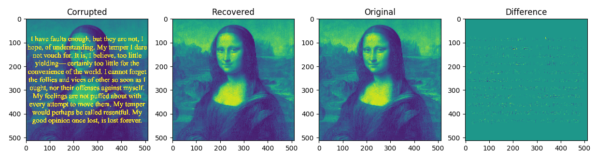
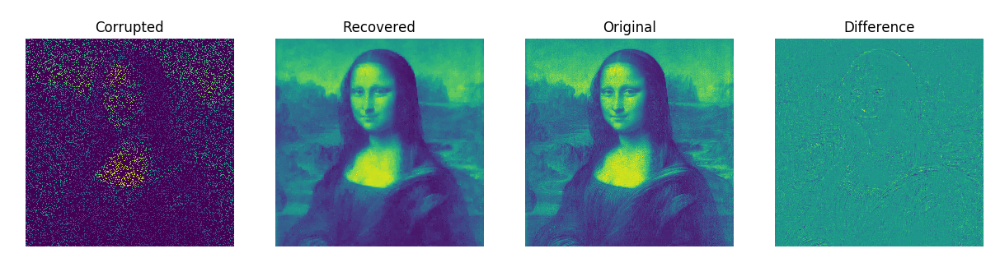

### Total variation inpainting.
Here we use convex optimization to inpaint missing pixels in corrupted images.
The results are hard to believe. Keep in mind that the algorithm is never
exposed to the original image. It only has access to the corrupted image. In 
fact, observe in the API that our `inpaint` takes as its only arguments the 
corrupted image and the locations in the corrupted image of the pixels 
we know to be good (those pixels we should believe), the latter of which
can be obtained without any reference to the original image.

In this example the image is corrupted by text.

In this example only 20% of the pixels are visible!

Problem size: 
- 784,386 variables (512 x 512)
- ~1,800,000 constraints

Solve time: 
- 90-180 seconds per problem
