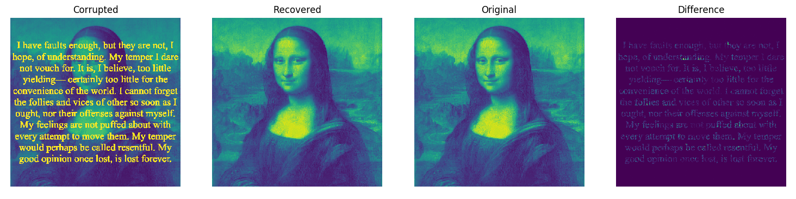
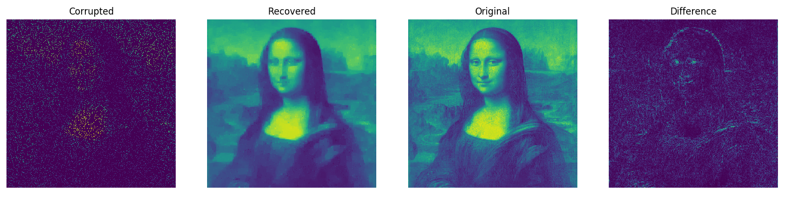
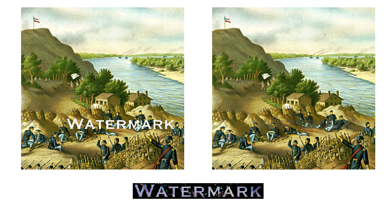

### Total variation inpainting.
Here we use convex optimization to inpaint missing pixels in corrupted images.
We find the discrete gradient and minimize its l1 norm under the constraint
that the pixels in the recovered image must match the correponding pixels in
the corrupt image in all places where there is no corrupting noise.

The method is simple but the results are hard to believe. Keep in mind 
that the algorithm is never exposed to the original image. In fact, 
observe in the API that our `inpaint` function takes as its only 
arguments the corrupted image and the locations in the corrupted image 
of the pixels we know to be good (those pixels we should believe), 
the latter of which can be obtained without any reference to the 
original image, for instance by annotation, using heuristics, 
or by exploiting priors. 

Here we use inpainting for text removal.

In this example only 10% of the pixels are visible.

Here is an example where we use a crude heuristic to 
localize a watermark, and then use inpainting to remove it.

Problem size: 
- 784,386 variables (512 x 512)
- ~1,800,000 constraints

Solve time: 
- 110 seconds per problem (amortized)
